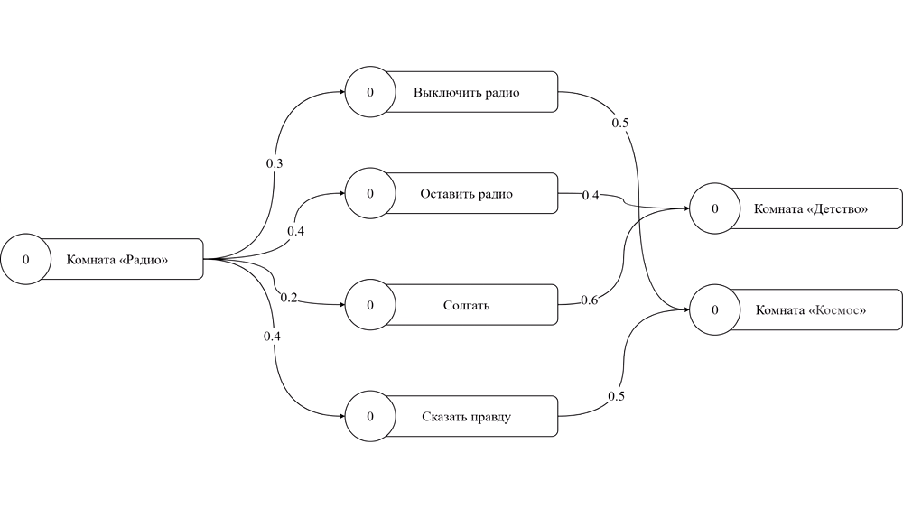

For English version see [README_EN](./README_EN.md)

Скачать и протестировать игру или посмотреть геймплей можно [здесь](https://drive.google.com/drive/folders/1WAovOSE2plTqHgdcXURzEH9bxl-jWPas?usp=sharing)

## Введение

Данная игра является дипломной работой и демонстрирует новый подход в реализации игровой механики решения с последствиями. 
Текущие подходы к реализации нелинейных игр завязаны на жёстком кодировании, где последствия выборов игрока зачастую изолированы друг от друга. 

## Реализация

Механика решения с последствиями реализована с использованием алгоритма распространения активации, общую суть которого можно прочитать на [Википедии](https://en.wikipedia.org/wiki/Spreading_activation).

Для использования алгоритма, сюжет игры был представлен в виде графа, где узлами являются локации и действия, которые можно совершить в этих локациях. Когда игрок совершает какое-либо действие или попадает в новую локацию – активируется соответствующий узел, уровень активации от него распространяется к его соседям, а от них к их соседям и т.д.

Когда игрок решит перейти на следующую локацию будет выбрана та, у которой уровень активации больше. Совершённые (или несовершённые) игроком действия влияют не только на ближайшее будущее, но и на отдалённое.

## Примечания

Игра была разработана на Unity с использованием Ink для диалогов и xNode для работы с графом.

Разработка этой игры была попыткой создать более универсальный подход к реализации механики решения с последствиями. Однако, даже представленный подход не является общим и требует корректировки в зависимости от проекта.