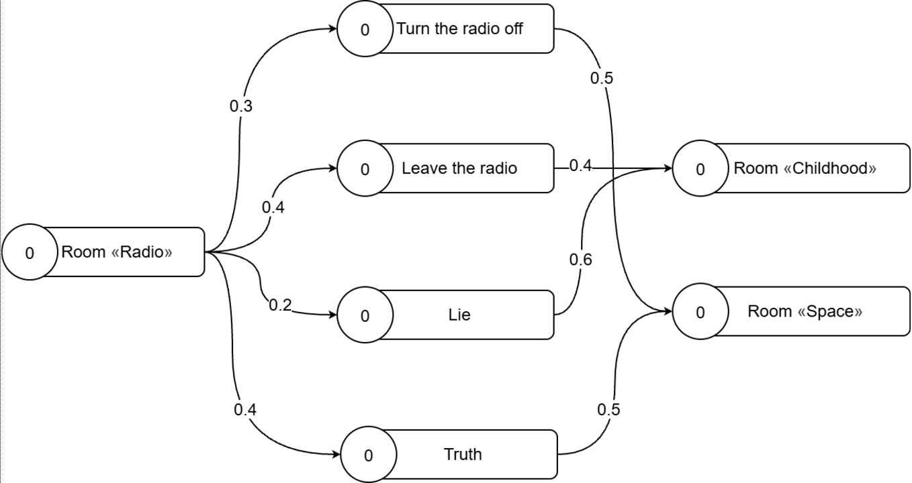

You can download and test game or watch gameplay [here](https://drive.google.com/drive/folders/1WAovOSE2plTqHgdcXURzEH9bxl-jWPas?usp=sharing) (for now it’s only in Russian).

## Introduction

This game is a diploma project and demonstrates a new approach to implementing game mechanics involving choices and consequences.
Current approaches in developing non-linear games restricted by hard coding, where the consequences of player’s choices are isolated from one another.

## Implementation

The mechanic of decision‑making with consequences is implemented using the spreading activation algorithm, the general concept of which you can find [here](https://en.wikipedia.org/wiki/Spreading_activation).

To use the algorithm, the game’s plot was represented as graph, where nodes are game locations and actions that can be performed in those locations. When player makes a decision or enters a new location, the corresponding node is activated. It’s activation level spreads to its neighbors, and from them to theirs neighbors and so on.
 

When player decides to move to the next location, the one with higher activation level will be selected. The actions (or inactions) performed by player affect both near and distant future.

## Additional

The game was developed in Unity using Ink for dialogues and xNode for creating and managing the graph.

This game was an attempt to create a more universal approach to implementing choices and consequences mechanic. However, even this approach is not generic and requires significant changes depending on the project.
